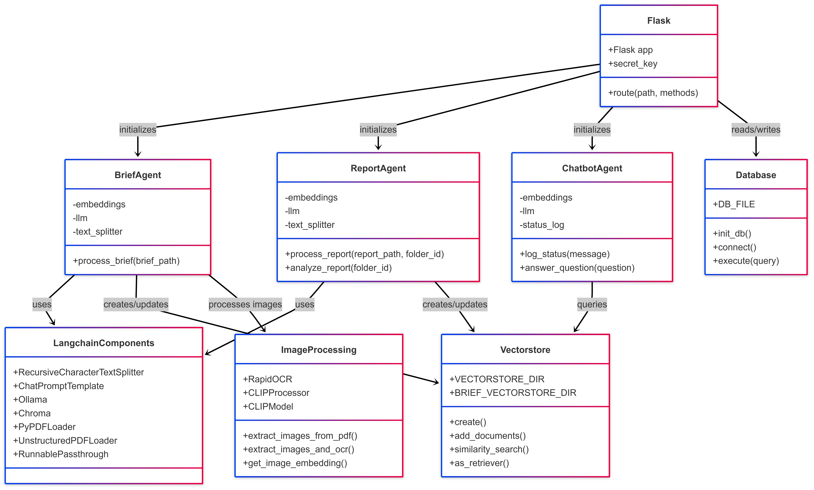
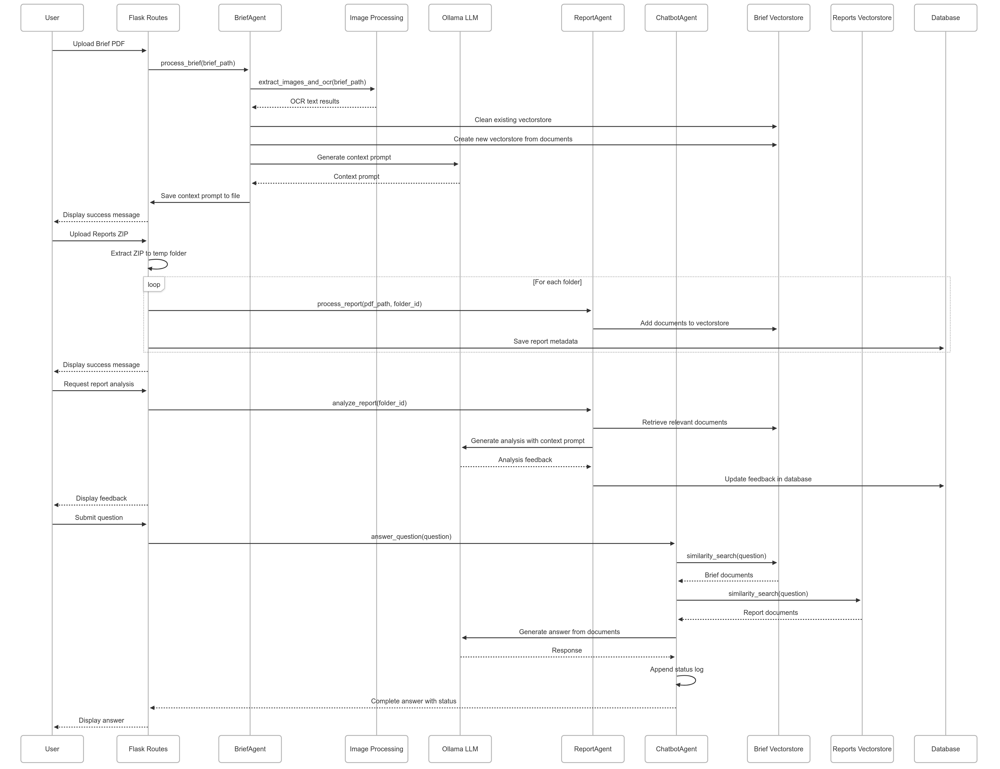

# Assessment Manager Flask Application

This Flask application is designed to help manage and analyze assessment briefs and student reports. It uses RAG (Retrieval-Augmented Generation) with Ollama's Gemma3 model to process PDFs and generate feedback.





## Features

1. **Assessment Brief Upload**
   - Upload PDF assessment briefs
   - Extract key rubrics and criteria using RAG
   - Generate a context prompt for report evaluation

2. **Student Reports Upload**
   - Upload ZIP files containing multiple PDF reports
   - Organize reports by folder
   - Store report metadata in SQLite database
   - View and download reports

3. **Report Analysis**
   - Analyze reports against assessment criteria
   - Generate feedback based on the assessment brief
   - Select multiple reports for batch analysis

4. **Document Chatbot**
   - Ask questions about the assessment brief and reports
   - Get answers based on the document content

## Setup Instructions

### Prerequisites

- Python 3.8 or higher
- Ollama installed and running locally with the Gemma3 model
- Git (optional, for cloning the repository)

### Installation

1. Clone or download this repository:
   ```
   git clone <repository-url>
   ```

2. Navigate to the project directory:
   ```
   cd assessment-manager
   ```

3. Create a virtual environment:
   ```
   python -m venv venv
   ```

4. Activate the virtual environment:
   - On Windows:
     ```
     venv\Scripts\activate
     ```
   - On macOS/Linux:
     ```
     source venv/bin/activate
     ```

5. Install the required packages:
   ```
   pip install -r requirements.txt
   ```

6. Make sure Ollama is running with the Gemma3 model:
   ```
   ollama pull gemma3
   ollama run gemma3
   ```

### Running the Application

1. Start the Flask application:
   ```
   python app.py
   ```

2. Open your web browser and navigate to:
   ```
   http://127.0.0.1:5000/
   ```

## Usage Guide

### 1. Upload Assessment Brief

1. Navigate to the "Upload Assessment Brief" section
2. Click "Choose File" and select a PDF assessment brief
3. Click "Upload Brief"
4. The system will process the brief, create a vector store, and generate a context prompt

### 2. Upload Student Reports

1. Navigate to the "Upload Student Reports" section
2. Click "Choose File" and select a ZIP file containing student reports (PDFs)
3. Click "Upload Reports"
4. The system will extract the ZIP, process each PDF, and store the reports

### 3. Analyze Reports

1. View the list of uploaded reports
2. Select one or more reports using the checkboxes
3. Click "Analyze Selected" to generate feedback
4. Alternatively, click the "Analyze" button next to a specific report
5. View the feedback in the rightmost column

### 4. Using the Chatbot

1. Scroll to the "Chat with Documents" section
2. Type your question in the input field
3. Click "Send" or press Enter
4. The chatbot will retrieve relevant information from all documents

### 5. Managing Reports

- Click "Delete" next to a report to remove it
- Select multiple reports and click "Delete Selected" for batch deletion
- Click on file names to download individual reports

## Project Structure

- `/brief` - Stores the uploaded assessment brief
- `/uploads` - Stores extracted student reports
- `/vectorstore` - Contains the vector embeddings for reports
- `/brief_vectorstore` - Contains the vector embeddings for the assessment brief
- `context.txt` - Stores the generated context prompt
- `prompt_template.txt` - Template for generating the context prompt (customizable)
- `reports.db` - SQLite database for report metadata

## Technical Details

This application uses:
- Flask for the web framework
- SQLite for database storage
- Langchain for RAG processing
- Ollama/Gemma3 for LLM capabilities
- Chroma for vector storage
- Bootstrap for frontend styling
